# 数据预处理实训
## [0]简单数据预处理
主要使用Python的pandas，numpy库来预处理数据，处理过程如下：
0. 数据存在的问题<br>
（a）无论是字符串还是数值，都是加了双引号<br>
（b）缺失值的数据要剔除<br>
（c）字符串型的数值要转换成浮点型<br>
（d）时间列的数据非标准时间格式，要通过正则匹配转换成标准时间格式<br>
（e）数据按时间分成2019年和2020年2部分<br>
（f）数据按天进行统计每天的检测总数目<br>
（g）数据分组可视化，了解数据分布<br>
（h）预处理数据导出，进入下一阶段<br>
1. 读入数据#源文件太大 已压缩
2. 列索引处理：去除双引号
3. 挑出三列：时间列，特征1，特征2
4.去除有缺失值的数据
5.去除特征1，特征2的双引号，字符串类型转换成数值型
6. 时间列转化成标准时间格式
7. ‘年月日时分秒’格式转换成‘年月日’,方便按天统计
8.按日期进行groupby
9. 数据分组：2019和2020<br>
<em>处理结果可视化：</em><br>
2019数据分布（按日期排序）<br>
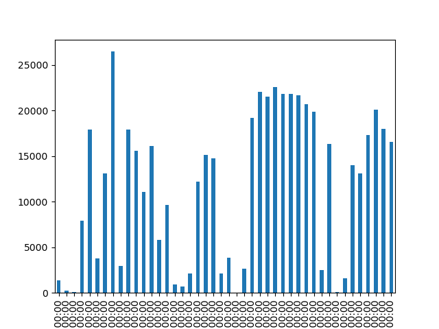
<br>2020数据分布（按日期排序）<br>
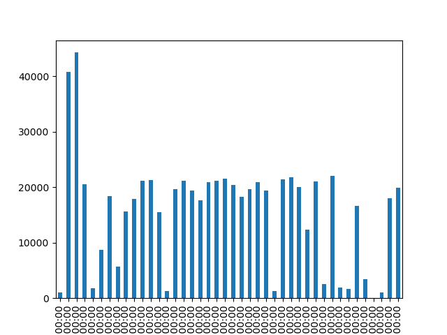
<br>2019数据分布（按数量排序）<br>
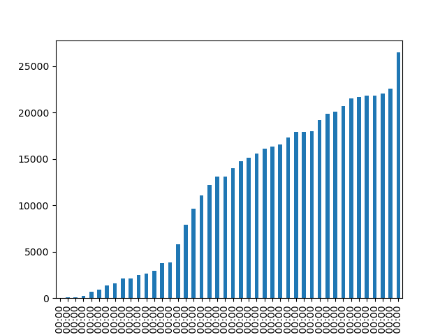
<br>2020数据分布（按数量排序）<br>
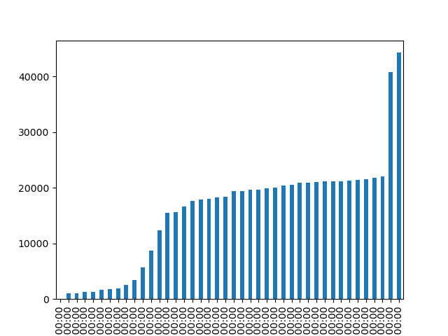

## [1]航空公司客户数据处理
### (a)背景与挖掘目标
信息时代的来临使得企业营销焦点从产品中心转变为客户中心，客户关系管理成为企业的核心问题。客户关系
管理的关键问题是客户分类，通过客户分类，区分无价值客户、高价值客户，企业针对不同价值的客户制定优化的
个性化服务方案，采取不同营销策略，将有限营销资源集中于高价值客户，实现企业利润最大化目标。准确的客户
分类结果是企业优化营销资源分配的重要依据，客户分类越来越成为客户关系管理中亟待解决的关键问题之一。面
对激烈的市场竞争，各个航空公司都推出了更优惠的营销方式来吸引更多的客户，国内某航空公司面临着旅客流
失、竞争力下降和航空资源未充分利用等经营危机。通过建立合理的客户价值评估模型，对客户进行分群，分析比
较不同客户群的客户价值，并制定相应的营销策略，对不同的客户群提供个性化的客户服务是必须和有效的。
目前该航空公司已积累了大量的会员档案信息和其乘坐航班记录，经加工后得到表所示的部分数据属性信息。
<br><em>航空公司客户数据格式：</em><br>
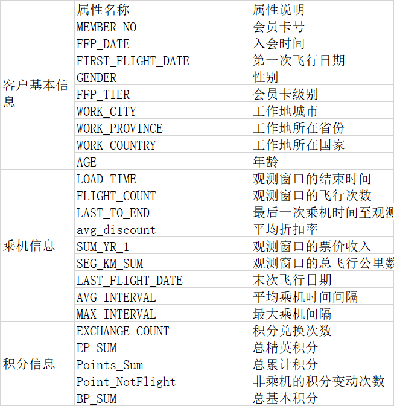
3）对不同价值的客户类别提供个性化服务，制定相应的营销策略。<br>
### (b)分析方法与过程
本案例的目标是客户价值识别，即通过航空公司客户数据识别不同价值的客户。识别客户价值应用最广泛的模
型是通过3个指标（最近消费时间间隔（Recency）、消费频率（Frequency）和消费金额（Monetary））来进行
客户细分，识别出高价值的客户，简称RFM模型。 在RFM模型中，消费金额表示在一段时间内，客户购买该企业
产品金额的总和。由于航空票价受到运输距离、舱位等级等多种因素影响，同样消费金额的不同旅客对航空公司的
价值是不同的。例如，一位购买长航线、低等级舱位票的旅客与一位购买短航线、高等级舱位票的旅客相比，后者
对于航空公司而言价值可能更高。因此，这个指标并不适用于航空公司的客户价值分析。我们选择客户在一定时间
内累积的飞行里程M和客户在一定时间内乘坐舱位所对应的折扣系数的平均值C两个指标代替消费金额。此外，考
虑航空公司会员入会时间的长短在一定程度上能够影响客户价值，所以在模型中增加客户关系长度L，作为区分客
户的另一指标。 本案例将客户关系长度L、消费时间间隔R、消费频率F、飞行里程M和折扣系数的平均值C五个指
标作为航空公司识别客户价值指标，记为LRFMC模型。<br>
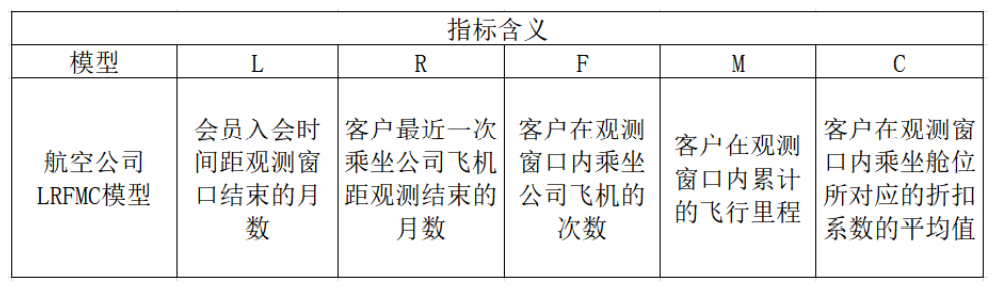<br>
针对航空公司LRFMC模型，如果采用传统RFM模型分析的属性分箱方法，如图所示（它是依据属性的平均值进
行划分，其中大于平均值的表示为上，小于平均值的表示为下），虽然也能够识别出最有价值的客户，但是细分的
客户群太多，提高了针对性营销的成本。因此，本案例采用聚类的方法识别客户价值。通过对航空公司客户价值的
LRFMC模型的五个指标进行K-Means聚类，识别出最有价值客户。<br>
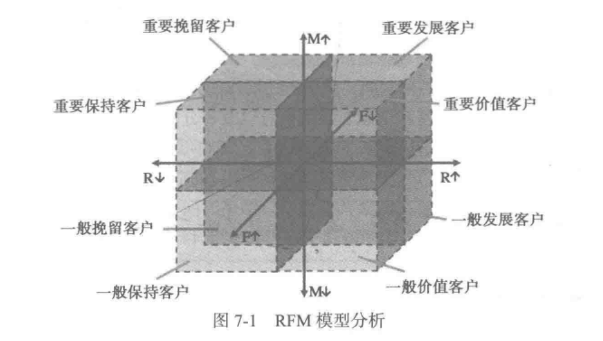<br>
本案例航空客户价值分析的总体流程如图所示。<br>
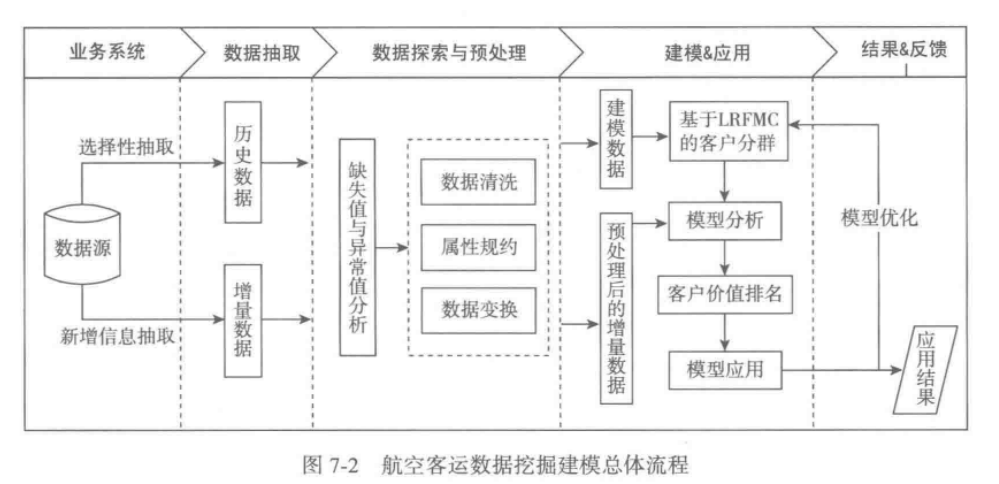<br>
航空客运信息挖掘主要包括以下步骤。<br>
1）从航空公司的数据源中进行选择性抽取与新增数据抽取分别形成历
史数据和增量数据。 <br>
2）对步骤1）中形成的两个数据集进行数据探索分析与预处理，包括数据缺失值与异常值的
探索分析，数据的属性规约、清洗和变换。 <br>
3）利用步骤2）中形成的已完成数据预处理的建模数据，基于旅客价值LRFMC模型进行客户分群，对各个客户群进行特征分析，识别出有价值的客户。<br>
4）针对模型结果得到不同价值的客户，采用不同的营销手段，提供定制化的服务。<br>
#### (b0)数据抽取
以2014-03-31为结束时间，选取宽度为两年的时间段作为分析观测窗口，抽取观测窗口内有乘机记录的所有客
户的详细数据形成历史数据。对于后续新增的客户详细信息，以后续新增数据中最新的时间点作为结束时间，采用
上述同样的方法进行抽取，形成增量数据。从航空公司系统内的客户基本信息、乘机信息以及积分信息等详细数据
中，根据末次飞行日期（LAST_FLIGHT_DATE），抽取2012-04-01至2014-03-31内所有乘客的详细数据，总共有
62988条记录。其中包含了会员卡号、入会时间、性别、年龄、会员卡级别、工作地城市、工作地所在省份、工作
地所在国家、观测窗口结束时间、观测窗口乘机积分、飞行公里数、飞行次数、飞行时间、乘机时间间隔和平均折
扣率等44个属性。<br>
数据的基本描述<br>

```
|                         |   空值数 |        最大值 |   最小值 |
|:------------------------|---------:|--------------:|---------:|
| MEMBER_NO               |        0 |  62988        |     1    |
| FFP_DATE                |        0 |    nan        |   nan    |
| FIRST_FLIGHT_DATE       |        0 |    nan        |   nan    |
| GENDER                  |        3 |    nan        |   nan    |
| FFP_TIER                |        0 |      6        |     4    |
| WORK_CITY               |     2269 |    nan        |   nan    |
| WORK_PROVINCE           |     3248 |    nan        |   nan    |
| WORK_COUNTRY            |       26 |    nan        |   nan    |
| AGE                     |      420 |    110        |     6    |
| LOAD_TIME               |        0 |    nan        |   nan    |
| FLIGHT_COUNT            |        0 |    213        |     2    |
| BP_SUM                  |        0 | 505308        |     0    |
| EP_SUM_YR_1             |        0 |      0        |     0    |
| EP_SUM_YR_2             |        0 |  74460        |     0    |
| SUM_YR_1                |      551 | 239560        |     0    |
| SUM_YR_2                |      138 | 234188        |     0    |
| SEG_KM_SUM              |        0 | 580717        |   368    |
| WEIGHTED_SEG_KM         |        0 | 558440        |     0    |
| LAST_FLIGHT_DATE        |        0 |    nan        |   nan    |
| AVG_FLIGHT_COUNT        |        0 |     26.625    |     0.25 |
| AVG_BP_SUM              |        0 |  63163.5      |     0    |
| BEGIN_TO_FIRST          |        0 |    729        |     0    |
| LAST_TO_END             |        0 |    731        |     1    |
| AVG_INTERVAL            |        0 |    728        |     0    |
| MAX_INTERVAL            |        0 |    728        |     0    |
| ADD_POINTS_SUM_YR_1     |        0 | 600000        |     0    |
| ADD_POINTS_SUM_YR_2     |        0 | 728282        |     0    |
| EXCHANGE_COUNT          |        0 |     46        |     0    |
| avg_discount            |        0 |      1.5      |     0    |
| P1Y_Flight_Count        |        0 |    118        |     0    |
| L1Y_Flight_Count        |        0 |    111        |     0    |
| P1Y_BP_SUM              |        0 | 246197        |     0    |
| L1Y_BP_SUM              |        0 | 259111        |     0    |
| EP_SUM                  |        0 |  74460        |     0    |
| ADD_Point_SUM           |        0 | 984938        |     0    |
| Eli_Add_Point_Sum       |        0 | 984938        |     0    |
| L1Y_ELi_Add_Points      |        0 | 728282        |     0    |
| Points_Sum              |        0 | 985572        |     0    |
| L1Y_Points_Sum          |        0 | 728282        |     0    |
| Ration_L1Y_Flight_Count |        0 |      1        |     0    |
| Ration_P1Y_Flight_Count |        0 |      1        |     0    |
| Ration_P1Y_BPS          |        0 |      0.999989 |     0    |
| Ration_L1Y_BPS          |        0 |      0.999993 |     0    |
| Point_NotFlight         |        0 |    140        |     0    |
```

#### (b1)数据探索分析
<br>本案例的探索分析是对数据进行缺失值分析与异常值分析，分析出数据的规律以及异常值。通过对数据观察发
现原始数据中存在票价为空值，票价最小值为0、折扣率最小值为0、总飞行公里数大于0的记录。票价为空值的数
据可能是客户不存在乘机记录造成，其他的数据可能是客户乘坐0折机票或者积分兑换产生的。<br>

#### (b2)数据分布分析与汇总
<br>分别从客户基本信息、乘机信息、积分信息3个角度进行数据探索，寻找客户信息的分布规律。
<br>（1）选取客户基本信息的入会时间、性别、会员卡级别和年龄字段进行探索分析，探索客户的基本信息分布
情况<br>
得到各年份会员入会人数的直方图，如图所示，入会人数随年份的增长而增加，在2012年达到最高
峰。<br>
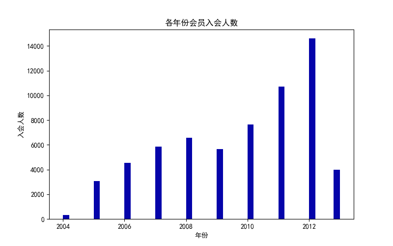
<br>得到会员性别比饼图，可以看到男性会员明显比女性会员多。<br>
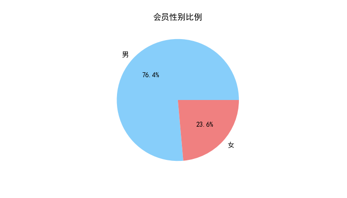
<br>得到会员各级别人数条形图，可以看出大部分会员为4级会员，仅有少数会员为5级会员和6级会员。<br>
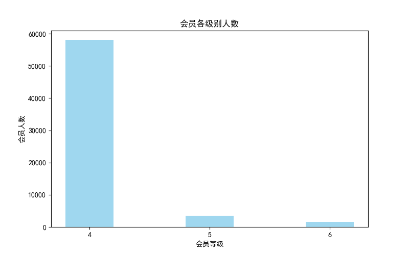
<br>得到会员年龄分布箱型图，可以看出大部分会员年龄集中在30-50岁之间，极少数的会员年龄小于
20岁或高于60岁，且存在一个超过100岁的异常数据。<br>
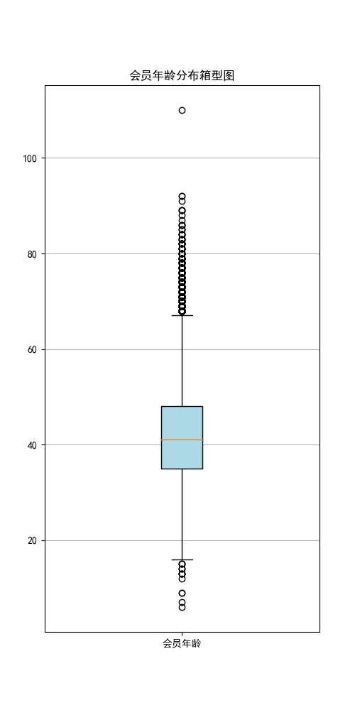
<br>绘制相关性热力图<br>
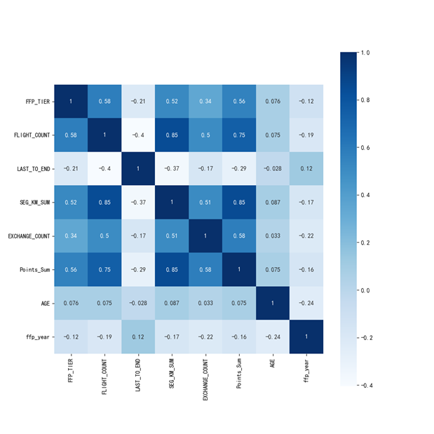<br>

### (c)数据处理
<br>本案例主要采用数据清洗、属性规约与数据变换的预处理方法。 
1.数据清洗 通过数据探索分析，发现数据中存在缺失值，票价最小值为0、折扣率最小值为0、总飞行公里数大于0的记录。由于原始数据量大，
这类数据所占比例较小，对于问题影响不大，因此对其进行丢弃处理。具体处理方法如下。 丢弃票价为空的记录。 丢弃票价为0、
平均折扣率不为0、总飞行公里数大于0的记录。 使用Pandas对满足清洗条件的数据进行丢弃，处理方法：满足清洗条件的一行数据全部丢弃；<br>
2.属性规约 原始数据中属性太多，根据航空公司客户价值LRFMC模型，选择与LRFMC指标相关的6个属性：
FFP_DATE、LOAD_TIME、FLIGHT_COUNT、AVG_DISCOUNT、SEG KM_SUM、LAST_TO_END。删除与其不相
关、弱相关或冗余的属性，例如，会员卡号、性别、工作地城市、工作地所在省份、工作地所在国家和年龄等属性。<br>
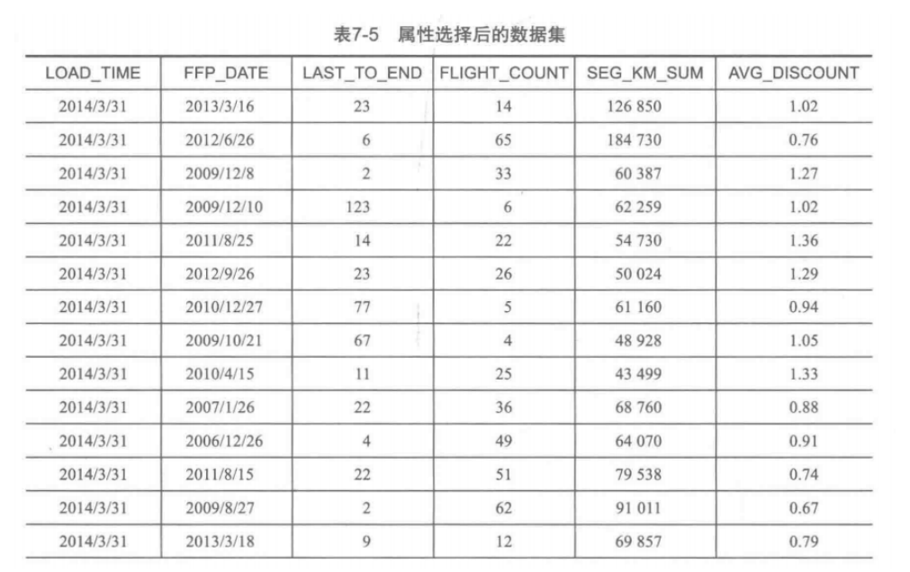<br>
3.数据变换 数据变换是将数据转换成“适当的”格式，以适应挖掘任务及算法的需要。本案例中主要采用的数据
变换方式为属性构造和数据标准化。 由于原始数据中并没有直接给出LRFMC五个指标，需要通过原始数据提取这五个指标，具体的计算方式如下:<br>
（1）L=LOAD_TIME-FFP_DATE 会员入会时间距观测窗口结束的月数=观测窗口的结束时间一入会时间[单位：月] <br>
（2）R=LAST TO END  客户最近一次乘坐公司飞机距观测窗口结束的月数=最后一次乘机时间至观察窗口末端时长[单位：月] <br>
（3）F=FLIGHT COUNT  客户在观测窗口内乘坐公司飞机的次数=观测窗口的飞行次数[单位：次] <br>
（4）M=SEG KM_SUM客户在观测时间内在公司累计的飞行里程=观测窗口的总飞行公里数[单位：公里] <br>
（5）C=AVG DISCOUNT  客户在观测时间内乘坐舱位所对应的折扣系数的平均值=平均折扣率[单位：无]<br>
5个指标的数据提取后，对每个指标数据分布情况进行分析，其数据的取值范围见表<br>
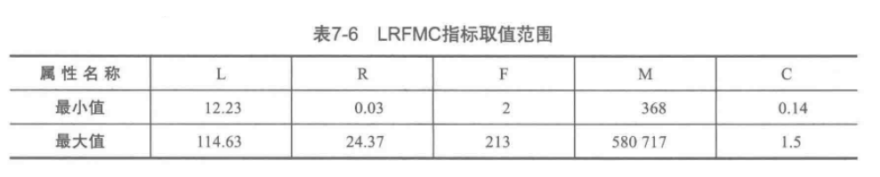<br>
从表中数据可以发现， 5个指标的取值范围数据差异较大，为了消除数量级数据带来的影响，需要对数据进行标准化处理。<br>
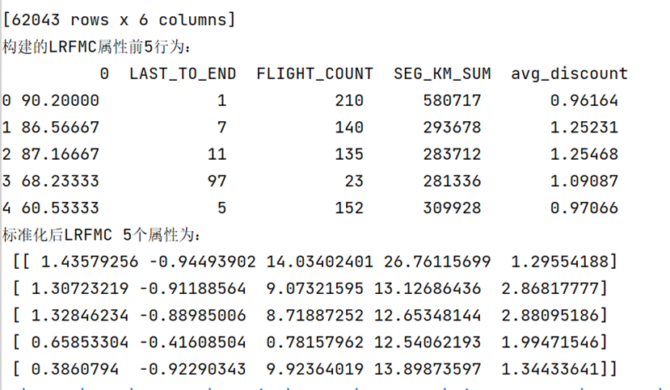<br>
标准差标准化处理后，形成ZL、ZR、ZF、ZM、ZC 5个属性的数据，如表所示<br>
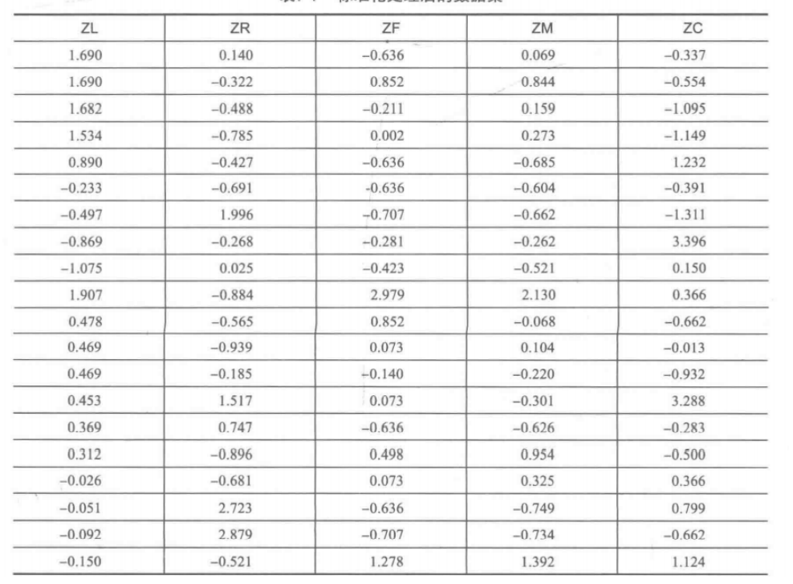<br>

### (d)模型构建
<br>客户价值分析模型构建主要由两个部分构成，第一个部分根据航空公司客户5个指标的数据，对客户进行聚类
分群。第二部分结合业务对每个客户群进行特征分析，分析其客户价值，并对每个客户群进行排名。
#### 1.客户聚类
采用K-Means聚类算法对客户数据进行客户分群，聚成5类（需要结合业务的理解与分析来确定客户的类别数
量）。 K-Means 聚类算法位于Scikit-Learn库下的聚类子库（sklearn.cluster），聚类类别数为k=5。
<br>对数据进行聚类分群的结果如图所示。<br>
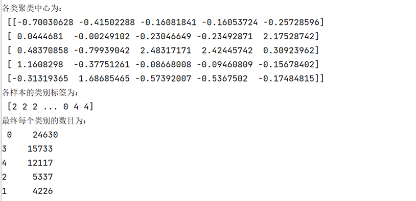
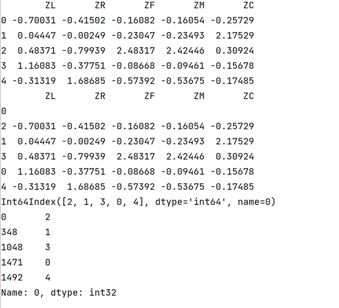

#### 2.客户价值分析
针对聚类结果进行特征分析，绘制客户分群雷达图如图所示。<br>
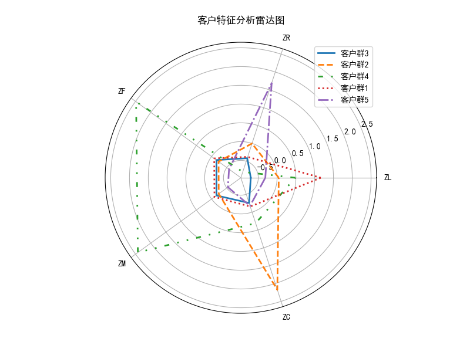
<br>其中，客户群1在C属性上最大，在F、M属性上最小，说明客户群1是偏好乘坐高级舱位的客户群；客户群2在
F、M属性上最大，切在特征R处的值最小，说明客户群2的会员频繁乘机且近期都有乘机记录；客户群3在R属性上
最大，在L、F、M、C属性上都较小，说明客户群3已经很久没有乘机，是入会时间较短的低价值客户群；客户群4
在所有特征属性上都较小，说明客户群4是属于新入会员较多的客户群；客户群5在L属性上最大，在特征R处的值
较小，其他特征值比较适中，说明客户群5入会时间比较长、飞行频率也较高，是较高价值的客户群。
从而总结出每个群的优势和弱势特征，具体结果如表所示。<br>
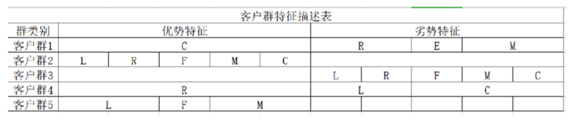<br>
<br>由上述的特征分析的图表说明每个客户群的都有显著不同的表现特征，基于该特征描述，本案例定义五个等级
的客户类别：重要保持客户、重要发展客户、重要挽留客户、一般客户、低价值客户。他们之间的区别如图所示<br>
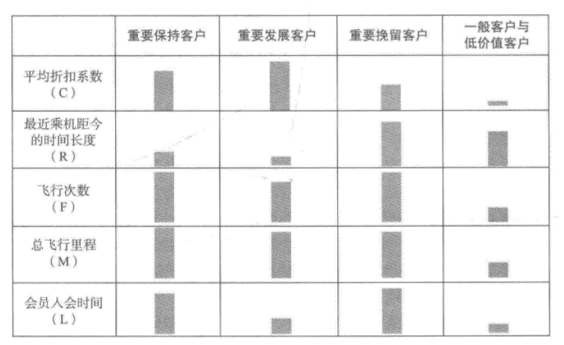<br>
<br>其中每种客户类别的特征如下：
<br>(1) 重要保持客户：这类客户的平均折扣率（C）较高（一般所乘航班的舱位等级较高），最近乘坐过本公司航
班（R）低，乘坐的次数（F）或里程（M）较高。他们是航空公司的高价值客户，是最为理想的客户类型，对航空
公司的贡献最大，所占比例却较小。航空公司应该优先将资源投放到他们身上，对他们进行差异化管理和一对一营
销，提高这类客户的忠诚度与满意度，尽可能延长这类客户的高水平消费。 
<br>(2) 重要发展客户：这类客户的平均折 扣率（C）较高，最近乘坐过本公司航班（R）低，但乘坐次数（F）或乘坐里程（M）较低。这类客户入会时长
（L）短，他们是航空公司的潜在价值客户。虽然这类客户的当前价值并不是很高，但却有很大的发展潜力。航空
公司要努力促使这类客户增加在本公司的乘机消费和合作伙伴处的消费，也就是增加客户的钱包份额。通过客户价
值的提升，加强这类客户的满意度，提高他们转向竞争对手的转移成本，使他们逐渐成为公司的忠诚客户。
<br>(3) 重要挽留客户：这类客户过去所乘航班的平均折扣率（C）、乘坐次数（F）或者里程（M）较高，但是较
长时间已经没有乘坐本公司的航班（R）高或是乘坐频率变小。他们客户价值变化的不确定性很高。由于这些客户
衰退的原因各不相同，所以掌握客户的最新信息、维持与客户的互动就显得尤为重要。航空公司应该根据这些客户
的最近消费时间、消费次数的变化情况，推测客户消费的异动状况，并列出客户名单，对其重点联系，采取一定的
营销手段，延长客户的生命周期。
<br>(4) 一般与低价值客户：这类客户所乘航班的平均折扣率（C）很低，较长时间
没有乘坐过本公司航班（R）高，乘坐的次数（F）或里程（M）较低，入会时长（L）短。他们是航空公司的一般
用户与低价值客户，可能是在航空公司机票打折促销时，才会乘坐本公司航班。
<br>其中，重要发展客户、重要保持客户、重要挽留客户这三类重要客户分别可以归入客户生命周期管理的发展
期、稳定期、衰退期三个阶段。 根据每种客户类型的特征，对各类客户群进行客户价值排名，其结果如表所示。针
对不同类型的客户群提供不同的产品和服务，提升重要发展客户的价值、稳定和延长重要保持客户的高水平消费、
防范重要挽留客户的流失并积极进行关系恢复。<br>
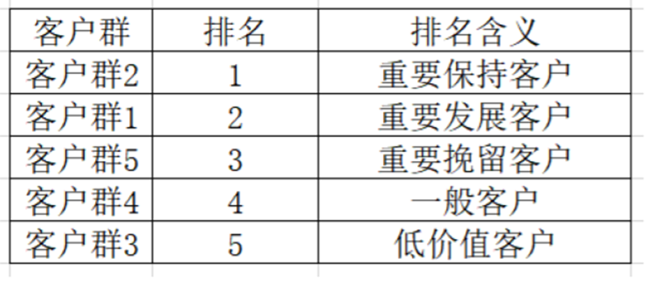
<br>本模型采用历史数据进行建模，随着时间的变化，分析数据的观测窗口也在变换。因此，对于新增客户详细信
息，考虑业务的实际情况，该模型建议每一个月运行一次，对其新增客户信息通过聚类中心进行判断，同时对本次
新增客户的特征进行分析。如果增量数据的实际情况与判断结果差异大，需要业务部门重点关注，查看变化大的原
因以及确认模型的稳定性。如果模型稳定性变化大，需要重新训练模型进行调整。目前模型进行重新训练的时间没
有统一标准，大部分情况都是根据经验来决定。根据经验建议：每隔半年训练一次模型比较合适。<br>
### (e)模型应用
<br>据对各个客户群进行特征分析，采取下面的一些营销手段和策略，为航空公司的价值客户群管理提供参考。
<br>（1）会员的升级与保级 航空公司的会员可以分为白金卡会员、金卡会员、银卡会员、普通卡会员，其中非普通卡
会员可以统称为航空公司的精英会员。虽然各个航空公司都有自己的特点和规定，但会员制的管理方法是大同小异
的。成为精英会员一般都是要求在一定时间内（如一年）积累一定的飞行里程或航段，达到这种要求后就会在有效
期内（通常为两年）成为精英会员，并享受相应的高级别服务。有效期快结束时，根据相关评价方法确定客户是否
有资格继续作为精英会员，然后对该客户进行相应地升级或降级。 然而，由于许多客户并没有意识到或根本不了解
会员升级或保级的时间与要求（相关的文件说明往往复杂且不易理解），经常在评价期过后才发现自己其实只差一
点就可以实现升级或保级，却错过了机会，使之前的里程积累白白损失。同时，这种认知还可能导致客户的不满，
干脆放弃在本公司的消费。 因此，航空公司可以在对会员升级或保级进行评价的时间点之前，对那些接近但尚未达
到要求的较高消费客户进行适当提醒甚至采取一些促销活动，刺激他们通过消费达到相应标准。这样既可以获得收
益，同时也提高了客户的满意度，增加了公司的精英会员。
<br>（2）首次兑换 航空公司常旅客计划中最能够吸引客户的内容就是客户可以通过消费积累的里程来兑换免票或
免费升舱等。各个航空公司都有一个首次兑换标准，也就是当客户的里程或航段积累到一定程度时才可以实现第一
次兑换，这个标准会高于正常的里程兑换标准。但是很多公司的里程积累随着时间会进行一定地削减，例如有的公
司会在年末对该年积累的里程进行折半处理。这样会导致许多不了解情况的会员白白损失自己好不容易积累的里
程，甚至总是难以实现首次兑换。同样，这也会引起客户的不满或流失。可以采取的措施是从数据库中提取出接近
但尚未达到首次兑换标准的会员，对他们进行提醒或促销，使他们通过消费达到标准。一旦实现了首次兑换，客户
在本公司进行再次消费兑换就比在其他公司进行兑换要容易许多，在一定程度上等于提高了转移的成本。另外，在
一些特殊的时间点（如里程折半的时间点）之前可以给客户一些提醒，这样可以增加客户的满意度。
<br>（3）交叉销售 通过发行联名卡等与非航空类企业的合作，使客户在其他企业的消费过程中获得本公司的积
分，增强与公司的联系，提高他们的忠诚度。例如，可以查看重要客户在非航空类合作伙伴处的里程积累情况，找
出他们习惯的里程积累方式（是否经常在合作伙伴处消费、更喜欢消费哪些类型合作伙伴的产品），对他们进行相
应促销。 客户识别期和发展期为客户关系打下基石，但是这两个时期带来的客户关系是短暂的、不稳定的。企业要
获取长期的利润，必须具有稳定的、高质量的客户。保持客户对于企业是至关重要的，不仅因为争取一个新客户的
成本远远高于维持老客户的成本，更重要的是客户流失会造成公司收益的直接损失。因此，在这一时期，航空公司
应该努力维系客户关系，使之处于较高的水准，最大化生命周期内公司与客户的互动价值，并使这样的高水平尽可
能延长。对于这一阶段的客户，主要应该通过提供优质的服务产品和提高服务水平来提高客户的满意度。通过对旅
客数据库的数据挖掘、进行客户细分，可以获得重要保持客户的名单。这类客户一般所乘航班的平均折扣率
（C）较高，最近乘坐过本公司航班（R低）、乘坐的频率（F）或里程（M）也较高。他们是航空公司的价值客户，是最
理想的客户类型，对航空公司的贡献最大，所占比例却比较小。航空公司应该优先将资源投放到他们身上，对他们
进行差异化管理和一对一营销，提高这类客户的忠诚度与满意度，尽可能延长这类客户的高水平消费<br>
[参考网址](https://www.jianshu.com/p/c736027b85a1)
## [2]商品购物篮分析
### 主要步骤
1.对原始数据进行数据探索性分析，分析商品的热销情况与商品结构<br>
2.对原始数据进行数据预处理，转换数据形式，使之符合Apriori关联规则算法要求。<br>
3.在步骤2得到的建模数据基础上，采用Apriori关联规则算法调整模型输入参数，完成商品关联性分析。<br>
4.结合实际业务，对模型结果进行分析，根据分析结果给出销售建议，最后输出关联规则的结果。<br>
本案例的探索分析是查看数据特征以及对商品热销情况和商品结构进行分析。<br>
某商品零售企业共收集了9835个购物篮数据，它主要包括3个属性:id,Goods和Types。<br>
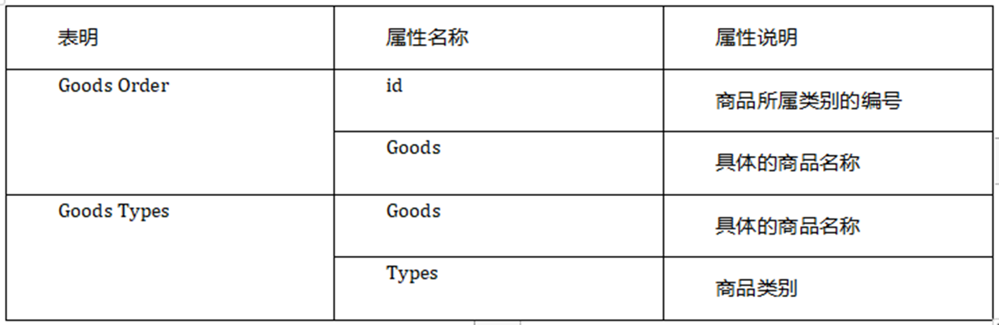
### 数据特征
·探索数据的特征，查看每列属性，最大值，最小值是了解数据的第一步<br>
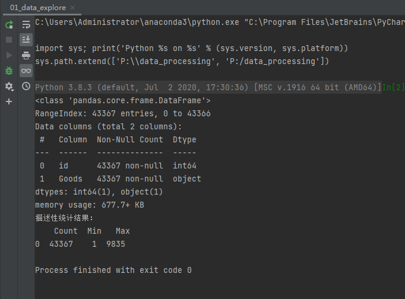<br>
·每列属性共有43367个观测值，并不存在缺失值。查看"id"属性的最大值和最小值，
可知某个商品零售企业共收集了9835个购物篮数据，其中包含169个不同的商品类别，
售出商品总数为43369件。<br>
### 分析热销商品
商品热销情况分析师商品管理中不可或缺的一部分，热销情况分析可以助力商品优选。<br>
计算销量排行前10的商品销量及占比，并绘制条形图显示销量前10的商品销量情况<br>
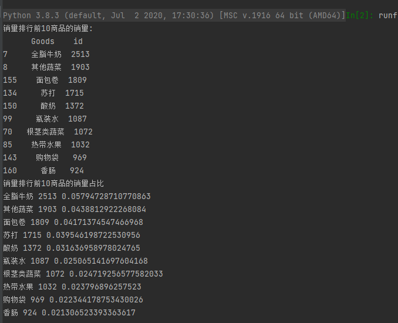
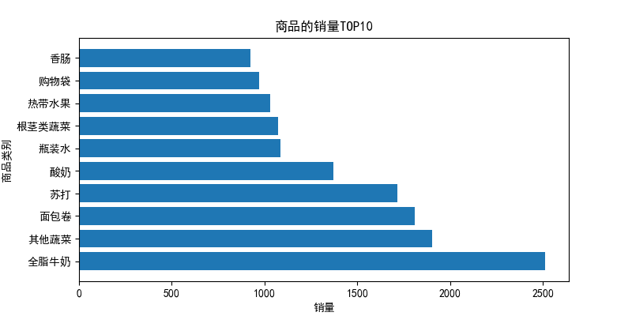
### 分析商品结构
对每一类商品的热销程度进行分析，有利于商家制定商品在货架上的摆放策略和位置，
若是某类商品较为热销，商场可以把此类商品摆放在商场 的中心位置，以方便顾客选购。<br>
原始数据在红的商品本身已经经过归类处理，但是部分商品还是存在一定的重叠，
故需要再次对其进行归类处理。<br>
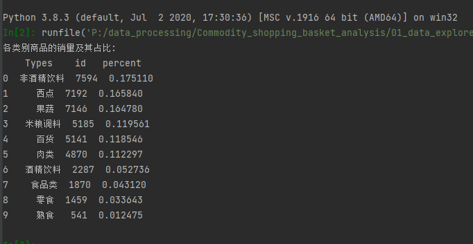
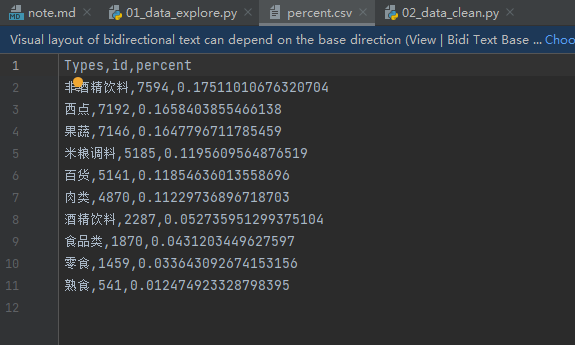
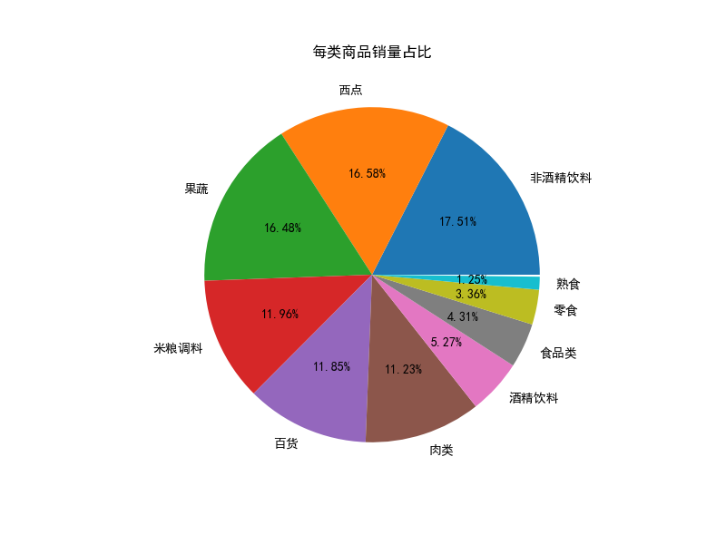
<br>通过分析各类别商品的销量及其占比情况可知，非酒精饮料、西点、果蔬2类商品的销量差距不大，占总销量的50%左右，同时，根据大类划分
发现，和食品类的销量总和接近90%，说明顾客倾向于购买此类商品，而其余商品仅是商场为满足顾客的其他需求而设定的，并非销售主力军。<br>
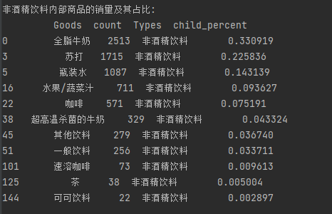
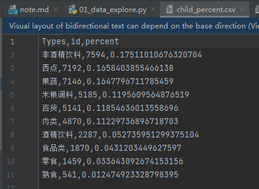
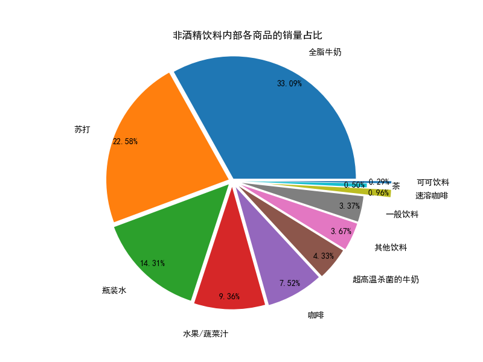
### 数据预处理
通过数据探索分析发现数据完整，并不存在缺失值。建模之前需要转变数据的格式，才能使用Apriori函数进行关联分析。对数据进行转换<br>
运行结果：<br>
数据转换结果的前5个元素：<br>

### 模型构建与关联
本案例的目的是探索商品之间的关联关系，因此采用关联规则算法，以挖掘他们之间的关系。Apriori算法是常用的关联规则算法之一，也是最为
经典的分析频繁相机的算法，他是第一次实现在大数据集上可行的关联规 则提取的算法。<br>


## [3]垃圾邮件分类
### 实验目的
本实验主要实现中文垃圾邮件分类验。通过该实验的学习与实践，可以：<br>
1.掌握sklearn基本用法。<br>
2.掌握jieba分词对中文的分词操作。<br>
3.运用伯努利贝叶斯分类器实现垃圾邮件分类。<br>
### 实验背景
文本挖掘（Text Mining，从文字中获取信息）是一个比较宽泛的概念，
这一技术在如今每天都有海量文本数据生成的时代越来越受到关注。目前，在机器学习模型的帮助下，
包括情绪分析，文件分类，话题分类，文本总结，机器翻译等在内的诸多文本挖掘应用都已经实现了自动化。
在这些应用中，垃圾邮件分类是一个经典的机器学习分类算法案例，接下来我们就实现以下中文垃圾邮件分类。
### 实验原理
#### 一、伯努利贝叶斯分类器原理
伯努利贝叶斯分类器将某类别下的文档的生成看作是做m次独立的贝努利试验，其中m是词汇表的长度，
每次试验都通过抛硬币（假定是1/2的比例，当然实际要通过统计）决定这次对应的词语是否在文本中出现。
因此它的似然概率计算公式为P(t|c)=类c文档集中包含词t的文档数/类c文档集中文档总数。
而多项式朴素贝叶斯将某类别下的文档的生成看成从词汇表中有放回的抽样，每次随机抽一个词出来，
一共抽取文档长度次（单词个数）。因此它的似然概率计算公式为P(t|c)=类c文档集中词语t出现的次数/类c文档集中词语总数。
#### 二、sklearn中使用伯努利贝叶斯分类器
Scikit-learn(sklearn)是机器学习中常用的第三方模块，对常用的机器学习方法进行了封装，包括回归(Regression)、
降维(Dimensionality Reduction)、分类(Classfication)、聚类(Clustering)等方法。当我们面临机器学习问题时，
便可根据下图来选择相应的方法。<br>
sklearn具有以下特点：<br>
1、简单高效的数据挖掘和数据分析工具<br>
2、让每个人能够在复杂环境中重复使用<br>
3、建立NumPy、Scipy、MatPlotLib之上<br>
sklearn伯努利贝叶斯分类器说明如下：<br>
class sklearn.naive_bayes.BernoulliNB(alpha=1.0, binarize=0.0, fit_prior=True, class_prior=None)<br>
参数介绍：<br>
alpha: 一个浮点数，平滑值。<br>
binarize: 一个浮点数或者None。如果为None，那么会假定原始数据已经二元化了；如果是浮点数，那么会以该数值为界，
特征取值大于它的作为1；特征取值小于它的作为0。采取这种策略来二元化。<br>
fit_prior: 布尔值。如果为True，则不去学习类别先验概率，替代以均匀分布；如果为False，则去学习类别先验概率。<br>
class_prior: 一个数组。它指定了每个分类的先验概率，如果指定了该参数，则每个分类的先验概率不再从数据集中学得。<br>
属性说明：<br>
class_count_: 一个数组，形状为(n_classes,)，是每个类别包含的训练样本数量<br>
feature_count_: 一个数组，形状为(n_classes, n_features)。训练过程中，每个类别每个特征遇到的样本数<br>
方法说明：<br>
fit(x, y[, sample_weight]): 训练模型<br>
predict(x): 用模型进行预测，返回预测值<br>
score(x, y[, sample_weight]): 返回在(x, y)上预测的准确率<br>
#### 三、jieba中文分词
 jieba是优秀的中文分词第三方库，需要额外安装。中文文本需要通过分词获得单个的词语， jieba库提供三种分词模式。<br>
精确模式：试图将语句最精确的切分，不存在冗余数据，适合做文本分析。<br>
全模式：将语句中所有可能是词的词语都切分出来，速度很快，但是存在冗余数据。<br>
搜索引擎模式：在精确模式的基础上，对长词再次进行切分。<br>
### 实验步骤
####  一、数据准备
我们将使用到sklearn机器学习库完成实验。为了方便学习，将邮件数据保存成文本格式，每行文本对应一个邮件，
数据在data/下。主要有表所示的两类数据：

|   数据名称    | 数据类型 |
| :-----------: | :------: |
| ham_data.txt  | 正常邮件 |
| spam_data.txt | 垃圾邮件 |
#### 二、 读取邮件数据、停用词列表转换
代码组织分为三个功能：<br>
data_loader.py： 读取邮件数据、停用词列表<br>
主要包括两个功能，get_data函数返回两个文本内容以及对应的标签，get_stopwords函数返回停用词集合。<br>
data_processing.py：数据清洗以及数据集转化<br>
norm_corpus函数用来对文本数据进行分词以及停用词过滤，convert_data函数使用的是sklearn库中
的Vectorizer进行文本数据集直接转换成可直接进行算法输入的矩阵形式。<br>
classifier.py：模型训练、预测、评价<br>
这里为了后面实验方便，先将所有数据集先划分为训练集和测试集再进行数据清洗。
后续实验使用的是CountVectorizer进行文本转换，x_train, x_test是转换后的矩阵。
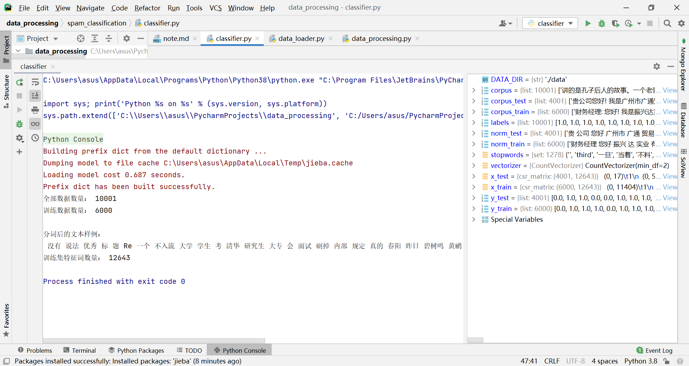
接下来要进行的是模型训练与预测,show_prediction函数中，训练模型只需要简单一句model.fit就可以完成模型训练，
调用函数输出测试集前两天记录的结果如下：
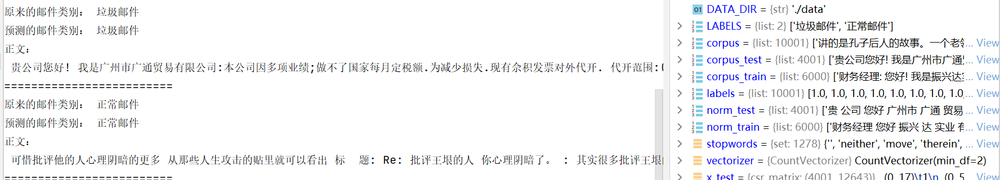<br>
可以看到模型对新的文本的类型都判断正确了。
### 五、模型评价
分类的评价指标有很多来自于信息检索（Infomation Retrival）领域，这里先介绍一下分类结果的四种可能：
- True positives(TP):  被正确地划分为正例的个数，即实际为正例且被分类器划分为正例的实例数（样本数）；
- False positives(FP): 被错误地划分为正例的个数，即实际为负例但被分类器划分为正例的实例数；
- False negatives(FN):被错误地划分为负例的个数，即实际为正例但被分类器划分为负例的实例数；
- True negatives(TN): 被正确地划分为负例的个数，即实际为负例且被分类器划分为负例的实例数。
可以用一个混淆矩阵（Confusion Matrix）来表示<br>
常用的分类评价指标准确率（Pression）、召回率（Recall）、精确率（Accuray）的公式如下：
$$
Pression={\frac {TP}{TP+FP}}
$$

$$
Recall = {\frac {TP}{TP+FN}}
$$

$$
Accuracy = {\frac {TP+FN}{TP+FN+FP+FN}}
$$

准确率和召回率整体上是负相关<br>
因此用F1-measure能更全面地评估分类整体效果：
$$
F1-measure = {\frac {2 * Pression*Recall}{Pression+Recall}}
$$
通过混淆矩阵以及各项评价指标，就可以很直观的比较每种分类器之间的优劣。在sklearn中，
这些评价函数都可以直接使用，无需自行实现，confusion_matrix函数可以直接返回混淆矩阵，
而classification_report函数直接包含准确率、召回率和F1。<br>
比较朴素贝叶斯和逻辑回归两个分类器的效果:
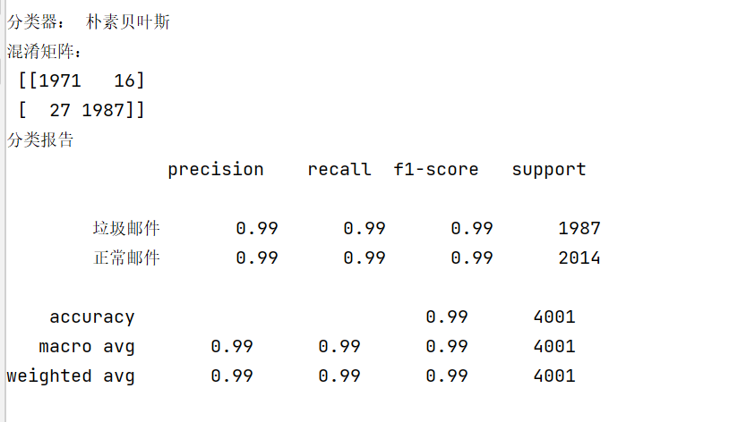
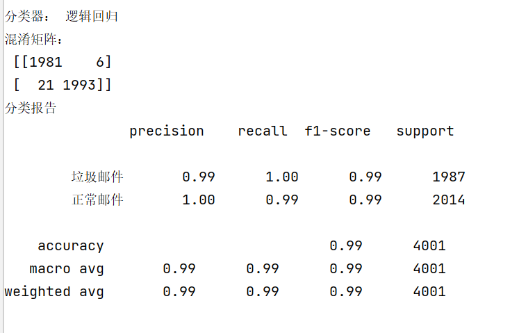
### 实验总结
从各项指标看，两种分类器对本数据集分类效果都很好。从混淆矩阵的结果可以看出逻辑回归模型比朴素贝叶斯模型效果更好一些。
<br>**<em>by learyuan</em><br>**
**<em>April 2021</em><br>**
[myblog_url](https://juejin.cn/post/6953084858868432910/)
